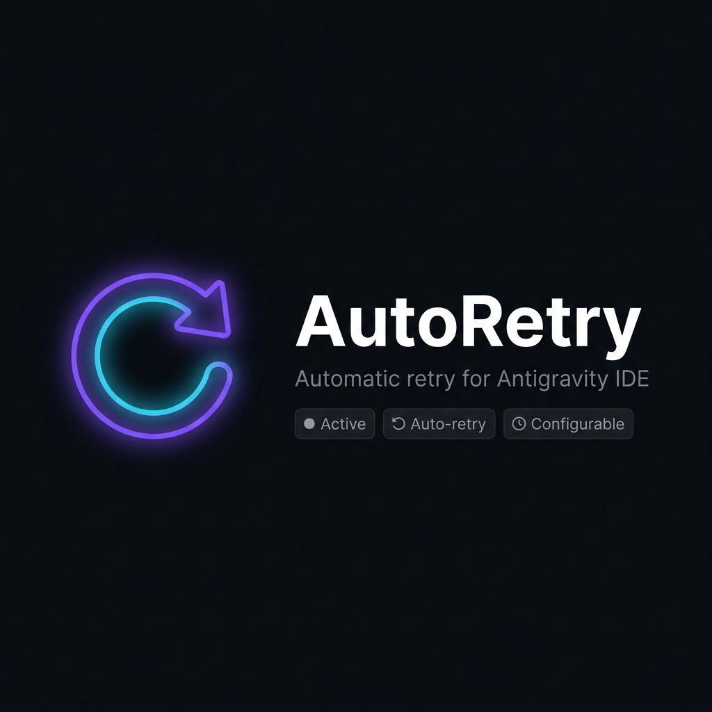

# Antigravity AutoRetry



<div align="center">

[](https://github.com/Davissss2/Antigravity-AutoRetry)
[](LICENSE)
[](https://marketplace.visualstudio.com/items?itemName=Davissss2.antigravity-autoretry)

**Stop babysitting your AI agent. Let AutoRetry do it for you.**

</div>

---

## What is this?

When **Antigravity IDE** (or any AI agent in VS Code) crashes with the dreaded _"Agent terminated due to error"_ dialog, you normally have to manually click **Retry** — sometimes dozens of times during a long session.

**Antigravity AutoRetry** watches over your agent 24/7 and automatically fires the retry command on a configurable timer, so you can step away and come back to a running session instead of a stalled one.

---

## Features

- 🔁 **Auto-Retry** — fires the Antigravity retry command on a configurable interval
- ⏱ **Live Countdown** — status bar shows seconds until the next retry in real time
- ⚡ **One-Click Toggle** — click the status bar item to instantly start or stop
- ⌨️ **Keyboard Shortcut** — `Ctrl+Shift+R` to retry now, `Ctrl+Shift+Alt+R` to toggle
- 🔍 **Smart Command Detection** — auto-discovers any retry command registered by Antigravity
- 🛠 **Custom Command** — point it at any VS Code command ID if needed
- 📋 **Retry Log** — full timestamped history in the Output panel

---

## Quick Start

### 1. Install
Search for **"Antigravity AutoRetry"** in the VS Code Extensions marketplace and click **Install**.  
Or install the `.vsix` manually: `Extensions → ··· → Install from VSIX…`

### 2. It starts automatically
Once installed, the extension is **on by default**. Look at the bottom-right status bar:

```
$(sync~spin)  AutoRetry: 28s
```

That countdown shows the seconds until the next automatic retry.

### 3. Toggle with one click
Click that status bar item (or press `Ctrl+Shift+Alt+R`) to **turn it on/off** instantly.

### 4. Retry immediately
Press `Ctrl+Shift+R` or open the Command Palette (`Ctrl+Shift+P`) and run **`AutoRetry: Retry Now`**.

---

## Status Bar

| State | Display |
|---|---|
| Active (counting down) | `↻ AutoRetry: 28s` |
| Disabled | `↻ AutoRetry: OFF` |

Click the item at any time to toggle.

---

## Settings

Open via **`AutoRetry: Open Settings`** in the Command Palette, or go to  
`File → Preferences → Settings` and search `autoretry`.

| Setting | Default | Description |
|---|---|---|
| `autoretry.enabled` | `true` | Start automatically when VS Code opens |
| `autoretry.intervalSeconds` | `5` | Seconds between each retry attempt (min: 3) |
| `autoretry.customCommand` | `""` | Custom VS Code command to run on each retry |
| `autoretry.notificationsEnabled` | `true` | Show status bar flash on retry |

> **Tip:** You can change the interval without touching settings — just run `AutoRetry: Set Interval` from the Command Palette (`Ctrl+Shift+P`) and type the number of seconds.

### Example — set a 60-second interval

```json
{
  "autoretry.intervalSeconds": 60
}
```

### Example — use a custom command

```json
{
  "autoretry.customCommand": "my.extension.retryCommand"
}
```

---

## Keyboard Shortcuts

| Shortcut | Action |
|---|---|
| `Ctrl+Shift+R` | Retry right now |
| `Ctrl+Shift+Alt+R` | Toggle AutoRetry on/off |

---

## Commands (Command Palette)

| Command | Description |
|---|---|
| `AutoRetry: Toggle On/Off` | Start or stop the auto-retry timer |
| `AutoRetry: Enable` | Enable AutoRetry |
| `AutoRetry: Disable` | Disable AutoRetry |
| `AutoRetry: Retry Now` | Fire a retry immediately |
| `AutoRetry: Set Interval` | Change the interval interactively |
| `AutoRetry: Show Log` | Open the retry history log |
| `AutoRetry: Clear Log` | Clear the retry history |
| `AutoRetry: Open Settings` | Jump to extension settings |

---

## How it works

1. On activation, a **timer** starts with your configured interval.
2. Every tick, it scans all registered VS Code commands for known Antigravity retry commands (`antigravity.retry`, `antigravity.retryLastRequest`, etc.).
3. The first matching command found gets executed automatically.
4. If no known command is found, it falls back to your `autoretry.customCommand` setting.
5. Everything is logged to the **Antigravity AutoRetry** output channel.

---

## Troubleshooting

**The extension doesn't seem to be retrying anything**  
→ Open the log (`AutoRetry: Show Log`) and check if a retry command was found.  
→ Set `autoretry.customCommand` to the exact command ID used by your version of Antigravity.

**How do I find the right command ID?**  
→ Open the Command Palette (`Ctrl+Shift+P`), type `retry`, and hover over the result to see its ID. Copy that ID into `autoretry.customCommand`.

**I want a longer/shorter interval**  
→ Use `AutoRetry: Set Interval` from the Command Palette, or edit `autoretry.intervalSeconds` in settings.

---

## Contributing

Pull requests and issues welcome at [github.com/Davissss2/Antigravity-AutoRetry](https://github.com/Davissss2/Antigravity-AutoRetry).

---

## License

MIT © [Davissss2](https://github.com/Davissss2)
